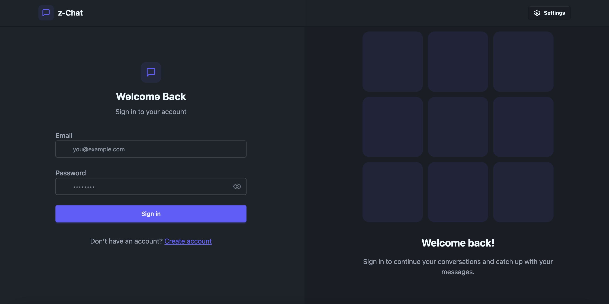
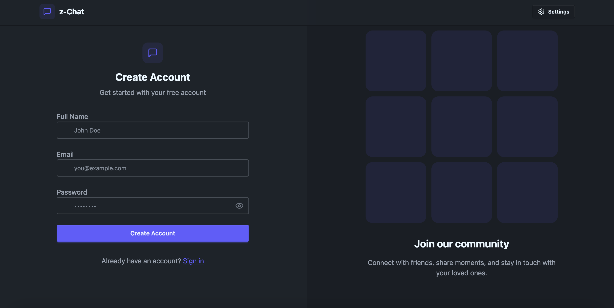
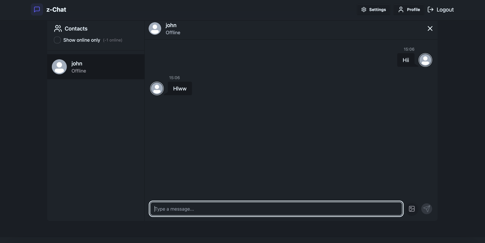
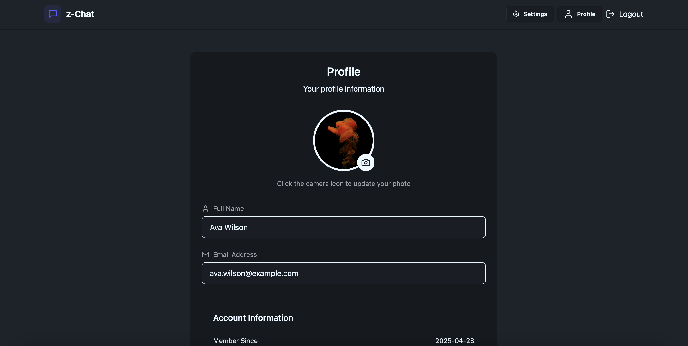

# Z Chat 🗨️

A real-time chat web application that allows users to connect, communicate, and share messages instantly.  
Built with a modern tech stack focusing on speed, responsiveness, and user experience.

---

## 🚀 Project Overview

Z Chat is a simple yet powerful real-time chat web app where users can create accounts, log in securely, and exchange messages instantly across a clean, mobile-friendly interface.  
It leverages **WebSockets** under the hood to ensure fast and smooth communication between users, making the chat experience lively and seamless.

Whether it's casual conversation or team collaboration, Z Chat keeps you connected!

---

## 🛠️ Tech Stack

### Frontend:

  
  
  
  

### Backend:

  
  
  
  
  

---

## 📸 Screenshots

| Login Page | SignUp Page | Chat Room | User Profile | 
|:----------:|:-----------:|:---------:|:------------:|
|  |  |  |  | 

---

## ✨ Features

- 🔥 Real-time chat functionality using WebSockets
- 🔒 Secure authentication with password hashing (bcrypt.js)
- 🖼️ Upload and manage profile pictures via Cloudinary
- 📢 Instant message broadcast to connected users
- 🛡️ Data validation and error handling
- 🌙 Light/Dark mode with DaisyUI theming
- ⚡ Smooth and minimalistic user experience

---

